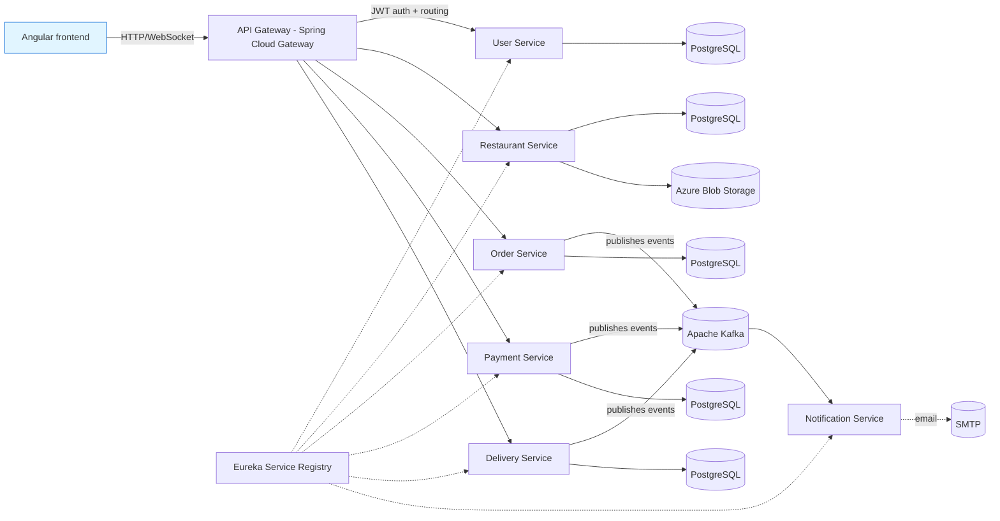

# Food Ordering and Delivery System

Microservices-based food ordering and delivery platform built with Spring Boot, Angular, and Apache Kafka. Supports four user roles — customers, restaurant admins, delivery drivers, and system admins — across services for users, restaurants, orders, payments, deliveries, and notifications.

> **Known applications:** Demo/portfolio-grade implementation modeled after platforms such as Uber Eats. Deployment infrastructure (Kubernetes manifests, CI/CD pipelines, Terraform) is included; no live deployment is currently operated by the author.

---

## Security Warning

This repository's history contains hardcoded credentials. **Before running or deploying this project, you must rotate all leaked credentials and externalise them to environment variables.**

Known secrets committed to history (do not reuse them):

| File | Exposed value |
| --- | --- |
| `docker-compose.yml` | `POSTGRES_PASSWORD` |
| `kubernetes/secrets.yaml` | `POSTGRES_PASSWORD` |
| `backend/*/src/main/resources/application.properties` | `spring.datasource.password`, `jwt.secret`, `azure.storage.connection-string` |

Because the project is public, anyone with access to its history can read these values. Treat every committed secret as compromised:

1. Rotate the PostgreSQL password used in any environment that ever ran this code.
2. Regenerate or revoke the Azure Storage account key referenced in `user-service`.
3. Replace the shared JWT signing secret with a fresh value before launching any service.

History rewriting has deliberately not been performed (it would rewrite public history, break existing forks, and remove evidence still in third-party caches). Instead, the recommended fix is credential rotation plus moving secrets to environment variables or a secret manager.

---

## Project Status

Portfolio project. The code base compiles and is structured for end-to-end execution, but it is **not** presented as production-ready. No live deployment is maintained by the author, and the cloud deployment URL listed elsewhere in the history (an AWS ELB endpoint) is no longer reachable.

## Key Features

Features are organised by user role and mirror the implemented services.

**Customer**

- Restaurant discovery and menu browsing
- Shopping cart with quantity management
- Stripe-based checkout (`payment-service`)
- Real-time order tracking via WebSocket/SSE payloads
- Order history

**Restaurant admin**

- Restaurant and menu CRUD (`restaurant-service`)
- Image uploads to Azure Blob Storage
- Order acceptance and status updates (`order-service`)
- Sales analytics within the admin dashboard

**Delivery driver**

- Delivery assignment (`delivery-service`)
- GPS location updates
- Delivery status management (Picked → In Transit → Delivered)

**System admin**

- User management and role-based access control (`user-service`)
- Platform health checks via Spring Boot Actuator

## Architecture

The system follows a microservices pattern with synchronous REST between client and gateway, and asynchronous Kafka events between services.



| Service | Port | Responsibility |
| --- | --- | --- |
| `service-registry` | 8761 | Netflix Eureka service discovery |
| `api-gateway` | 8080 | Spring Cloud Gateway with JWT validation and CORS |
| `user-service` | 8081 | Registration, login, profile, RBAC (`CUSTOMER`, `RESTAURANT`, `DELIVERY`, `ADMIN`) |
| `restaurant-service` | 8082 | Restaurant and menu CRUD, Azure Blob image storage |
| `order-service` | 8083 | Order placement, status workflow, Kafka event emission |
| `payment-service` | 8084 | Stripe payment processing, payment events |
| `delivery-service` | 8085 | Driver assignment, status and GPS updates |
| `notification-service` | 8086 | Kafka consumer, Spring Mail email notifications |

## Technology Stack

**Backend**
- Java 17, Spring Boot 3.4.4, Spring Cloud (Gateway, Netflix Eureka)
- Spring Security + JWT authentication
- Spring Data JPA + Hibernate, PostgreSQL driver
- Spring Mail (JavaMail), Springdoc OpenAPI
- Stripe Java SDK

**Frontend**
- Angular 19 (standalone components), TypeScript 5.7
- Tailwind CSS 4, PrimeNG 19, Font-Awesome
- `ngx-stripe` for Stripe Elements integration
- `@angular/google-maps` for driver tracking
- Angular SSR (`@angular/ssr`) and an nginx production image

**Messaging & data**
- Apache Kafka (via Spring Kafka) for inter-service events
- PostgreSQL 15 (one schema per service, database-per-service pattern)

**Cloud & infrastructure**
- Azure Blob Storage for restaurant/user images
- Docker, docker-compose for local orchestration
- Kubernetes manifests under `kubernetes/` (namespaces, configmaps, secrets, per-service deployments, ingress)
- Terraform under `terraform/` for AWS provisioning
- GitHub Actions CI/CD pipelines (`.github/workflows/`)

## Repository Structure

```
food-delivery-system/
├── backend/
│   ├── api-gateway/            # Spring Cloud Gateway (8080)
│   ├── user-service/          # Auth, users, RBAC (8081)
│   ├── restaurant-service/    # Restaurants, menus, Azure Blob (8082)
│   ├── order-service/         # Orders, Kafka producer (8083)
│   ├── payment-service/       # Stripe payments (8084)
│   ├── delivery-service/      # Driver assignment, GPS (8085)
│   ├── notification-service/  # Kafka consumer, email (8086)
│   └── service-registry/      # Netflix Eureka (8761)
├── frontend/                  # Angular 19 application, nginx config, Dockerfile
├── kubernetes/                # Kubernetes manifests, AWS subfolder, ingress
├── terraform/                 # AWS Terraform infrastructure
├── aws/                       # AWS-specific deployment assets
├── config/                    # Shared configuration
├── docs/                      # CI/CD guide, quickstart, AWS deployment guide
├── scripts/                   # PowerShell deployment/setup scripts
├── images/                    # Application screenshots
├── docker-compose.yml         # Local developer stack (Postgres, services)
├── init-db.sql                # Per-service database initialisation
└── create-admin.sql           # Admin user seeding script
```

> The tree above is curated; build outputs (`target/`, `dist/`, `node_modules/`) are omitted.

## Prerequisites

- **JDK 17** (Eclipse Temurin 17 used in the Dockerfiles)
- **Apache Maven 3.9+** (or the included Maven Wrapper `./mvnw`)
- **Node.js 20** and **npm** (matches the `node:20` frontend Docker image)
- **Angular CLI 19** — installed locally via `npm install`
- **PostgreSQL 15** when running outside Docker
- **Apache Kafka** (with Zookeeper or KRaft) for inter-service events
- **Docker** and **Docker Compose** for the local stack
- **Stripe** account in test mode for `payment-service`
- **Azure Storage** account for `restaurant-service` and `user-service` profile images
- (Optional) **kubectl** and a Kubernetes cluster for manifests under `kubernetes/`
- (Optional) **AWS CLI** and **Terraform** for AWS infrastructure provisioning

## Getting Started

### 1. Clone

```bash
git clone https://github.com/dilrukshax/food-delivery-system.git
cd food-delivery-system
```

### 2. Start infrastructure with Docker Compose

The included `docker-compose.yml` brings up Kafka, Zookeeper, and PostgreSQL with per-service databases. Review and override the PostgreSQL password first — see the Security Warning above.

```bash
docker compose up -d zookeeper kafka postgres
```

### 3. Initialise databases

```bash
psql -h localhost -U postgres -f init-db.sql
psql -h localhost -U postgres -d user_service_db -f create-admin.sql
```

### 4. Start backend services

Open one terminal per service (Maven Wrapper is included in each `backend/*` directory).

```bash
# Required first — service registry
cd backend/service-registry && ./mvnw spring-boot:run

# Then, in separate terminals:
cd backend/api-gateway        && ./mvnw spring-boot:run
cd backend/user-service       && ./mvnw spring-boot:run
cd backend/restaurant-service && ./mvnw spring-boot:run
cd backend/order-service      && ./mvnw spring-boot:run
cd backend/payment-service    && ./mvnw spring-boot:run
cd backend/delivery-service   && ./mvnw spring-boot:run
cd backend/notification-service && ./mvnw spring-boot:run
```

### 5. Start the frontend

```bash
cd frontend
npm install
npm start
```

### 6. Access the application

| Endpoint | URL |
| --- | --- |
| Angular UI | http://localhost:4200 |
| API Gateway | http://localhost:8080 |
| Eureka dashboard | http://localhost:8761 |
| OpenAPI/Swagger UI | http://localhost:8080/swagger-ui.html (per-service docs paths also exposed, e.g. `/user-service/v3/api-docs`) |

## Environment Variables

The application currently reads its secrets from `application.properties` files (see Security Warning). The recommended pattern is to externalise them. Example environment-variable contract:

```bash
# Database
SPRING_DATASOURCE_URL=jdbc:postgresql://localhost:5432/{service}_db
SPRING_DATASOURCE_USERNAME=postgres
SPRING_DATASOURCE_PASSWORD=your-rotated-password

# JWT
JWT_SECRET=your-rotated-256-bit-secret-key
JWT_EXPIRATION=86400000
JWT_REFRESH_EXPIRATION=604800000

# Stripe
STRIPE_API_KEY=sk_test_your_stripe_secret_key

# Azure Blob Storage
AZURE_STORAGE_CONNECTION_STRING=your-rotated-azure-connection-string
AZURE_STORAGE_CONTAINER_NAME=your-container-name

# Eureka
EUREKA_CLIENT_SERVICE_URL_DEFAULT_ZONE=http://localhost:8761/eureka/
```

The default `application.properties` files do not yet read these variables — they are listed here as the contract that should be applied before running the app with real credentials. Pull requests that migrate these properties to environment-variable placeholders are welcome.

## Database Setup

Each service owns a PostgreSQL database. The names are defined in `init-db.sql`:

- `user_service_db`
- `restaurant_service_db`
- `order_service_db`
- `payment_service_db`
- `delivery_service_db`
- `notification_service_db`

Hibernate is configured with `spring.jpa.hibernate.ddl-auto=update`, so tables are created automatically from JPA entities on first run. Schema migrations are not used in this portfolio build.

To seed an initial admin user:

```bash
psql -h localhost -U postgres -d user_service_db -f create-admin.sql
```

See the full in-repo guides for advanced setup:

- `ADMIN_SETUP_GUIDE.md` — admin user creation walkthrough
- `CLOUD_ADMIN_SETUP.md` — cloud (Azure/AWS) admin setup
- `docs/QUICKSTART.md` — GitHub Actions CI/CD quickstart
- `docs/AWS_DEPLOYMENT_GUIDE.md` — AWS deployment walkthrough
- `docs/CI-CD-PIPELINE-GUIDE.md` — pipeline architecture details

## Running with Docker

A full-stack `docker-compose.yml` builds every backend service and the frontend:

```bash
docker compose up -d --build
```

The frontend is served by nginx using `frontend/nginx/nginx.conf`. Backend services use `application-docker.properties` (where present) or the default profile plus the Docker-injected environment variables.

Kubernetes manifests are available under `kubernetes/`:

```bash
kubectl apply -f kubernetes/namespace.yaml
kubectl apply -f kubernetes/configmap.yaml
kubectl apply -f kubernetes/secrets.yaml   # populate with rotated values first
kubectl apply -f kubernetes/
```

## API Documentation

Each Spring Boot service exposes OpenAPI 3 docs via Springdoc. With `api-gateway` running:

- Aggregate Swagger UI: `http://localhost:8080/swagger-ui.html`
- Per-service OpenAPI JSON: `/user-service/v3/api-docs`, `/restaurant-service/v3/api-docs`, etc.

Routes are declared in `backend/api-gateway/src/main/resources/application.properties`.

## Testing

Test sources live under `backend/*/src/test/` (JUnit 5) and `frontend/` (Karma + Jasmine).

Backend unit tests (per service):

```bash
cd backend/user-service && ./mvnw test
```

Frontend tests:

```bash
cd frontend
npm test                # interactive Karma
npm run test:headless   # single run, headless Chrome
npm run test:ci        # headless Chrome + coverage
```

**Tests were not executed as part of this documentation pass.** No CI badge is displayed because the passing state has not been verified here.

## Deployment

The repo contains the following deployment artefacts:

- **GitHub Actions** workflows under `.github/workflows/`:
  - `backend-ci-cd.yml`
  - `frontend-ci-cd.yml`
  - `orchestrator.yml` (orchestrates the above two)
- **Terraform** configuration under `terraform/` for AWS infrastructure
- **AWS** deployment assets under `aws/` and `scripts/deploy-to-aws.ps1`
- **Kubernetes** deployment manifests under `kubernetes/` (including `aws/`, `secrets.yaml`, `configmap.yaml`, `ingress.yaml`)

The previously advertised AWS ELB deployment URL is no longer reachable and has been removed from this README. Pull requests that point to a verified deployment are welcome.

## Screenshots

A repository screenshot is available at `images/UI.png`:


If the image is broken or outdated, please open an issue — do not introduce fabricated screenshots.

## Security Notes

Beyond the rotation warning above:

- The API gateway performs JWT validation and applies role-based access control via Spring Security `@PreAuthorize` annotations on the controllers.
- CORS is currently permissive (`allowedOrigins=*`) in `api-gateway/src/main/resources/application.properties` for demo convenience. Tighten this to your real origins before any non-local deployment.
- WebSocket / real-time endpoints rely on the JWT issued by `user-service`; verify token expiry has not been bypassed before exposing publicly.
- Payment processing is delegated to Stripe via `ngx-stripe` on the frontend and `stripe-java` on the backend; never expose your Stripe secret key in client bundles.

The presence of these controls does not imply the system is fully secure. Treat the repository as a demo until an independent security review is performed.

## Contributing

Contributions are welcome. To contribute:

1. Fork the repository.
2. Create a branch such as `feature/short-description` from `main`.
3. Make your changes, keeping the per-service database boundaries intact.
4. Run the relevant per-service test target (`./mvnw test` for backend, `npm test:headless` for frontend).
5. Open a pull request describing the change and any required env-var additions.

Please rotate any secret you encounter before pasting it to work. Do not commit real credentials, even in tests.

## License

No license file currently exists in this repository. By default, the copyright holder (Dilan Dilruksha) reserves all rights and no permission is granted to copy, distribute, or modify the code beyond what is required to view it on GitHub. If a permissive license is intended for this demo, add an explicit `LICENSE` file (for example MIT) in a separate change, ensuring that any third-party assets (Azure SDK samples, starter templates) are compatible. See the audit report for the open licensing decision.

## Author

Dilan Dilruksha
Software Engineer | Backend & Full-Stack Development
Portfolio: https://dilandilruksha.dev
LinkedIn: https://www.linkedin.com/in/dilan-dilruksha
GitHub: https://github.com/dilrukshax
